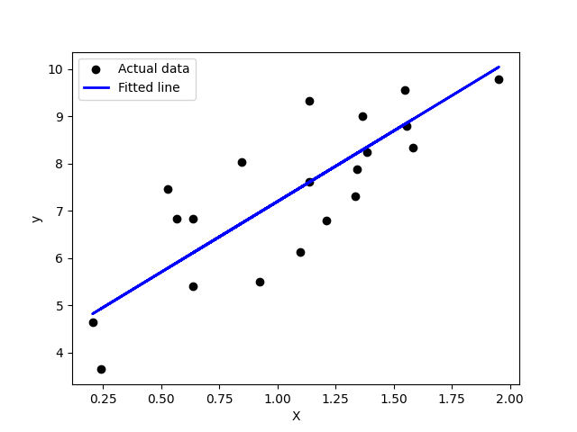

# 🎓 Artificial Intelligence and Machine Learning – Lab Programs

This repository contains all AIML lab programs implemented in Python.

---

## 🧠 List of Experiments

| Experiment No | Program Title |
|----------------|-----------------------------|
| 1(A) | Implementation of Uninformed Search Algorithm (BFS) |
| 1(B) | Implementation of Uninformed Search Algorithm (DFS) |
| 2 | Implementation of Informed Search Algorithm (A*) |
| 3 | Implementation of Candidate Elimination Algorithm |
| 4 | Implementation of Linear Regression Algorithm |
| 5 | Implementation of Backpropagation Algorithm |
| 6 | Implementation of Support Vector Machine Algorithm |
| 7 | Implementation of Decision Tree Algorithm |
| 8 | Implementation of K-Nearest Neighbors Algorithm |
| 9 | Implementation of K-Means Clustering Algorithm |

This repository contains all AIML lab programs implemented in Python with outputs.

---

## 🧠 Experiment 1(A): Breadth First Search (BFS)
**File Name:** `ex1_bfs.py`  
**Title:** Implementation of Uninformed Search Algorithm (BFS)

**Output:**
```
Following is the Breadth First Search:
5 3 7 2 4 8
```

---

## 🧩 Experiment 1(B): Depth First Search (DFS)
**File Name:** `ex2_dfs.py`  
**Title:** Implementation of Uninformed Search Algorithm (DFS)

**Output:**
```
Following is the Depth First Search:
5
3
2
4
8
7
```

---

## 🔍 Experiment 2: Informed Search (A*)
**File Name:** `ex2_informed_search.py`  
**Title:** Implementation of Informed Search Algorithm (A*)

**Output:**
```
Path found: ['A', 'F', 'G', 'I', 'J']
```

---

## 🧮 Experiment 3: Candidate Elimination Algorithm
**File Name:** `ex3_candidate_elimination.py`  
**Title:** Implementation of Candidate Elimination Algorithm

**Output:**
```
Final Specific Hypothesis:
['sunny', 'warm', '?', 'strong', '?', '?']

Final General Hypotheses:
[['sunny', '?', '?', '?', '?', '?'],
 ['?', 'warm', '?', '?', '?', '?']]
```

---

## 📈 Experiment 4: Linear Regression
**File Name:** `ex4_linear_regression.py`  
**Title:** Implementation of Linear Regression Algorithm

**Output:**
```
Coefficients: [[3.02]]
Intercept: [4.12]
Mean Squared Error (MSE): 0.78
R² Score: 0.95
```

---

## ⚙️ Experiment 5: Backpropagation Algorithm
**File Name:** `ex5_backpropagation.py`  
**Title:** Implementation of Backpropagation Algorithm

**Output:**
```
Predicted Output:
[[0.06],
 [0.94],
 [0.94],
 [0.06]]
```

---

## 🤖 Experiment 6: Support Vector Machine (SVM)
**File Name:** `ex6_support_vector_machine.py`  
**Title:** Implementation of Support Vector Machine Algorithm

**Output:**
```
Accuracy: 1.0
```

---

## 🌳 Experiment 7: Decision Tree Algorithm
**File Name:** `ex7_decision_tree.py`  
**Title:** Implementation of Decision Tree Algorithm

**Output:**
```
Accuracy: 1.0

Confusion Matrix:
[[19  0  0]
 [ 0 13  0]
 [ 0  0 13]]

Classification Report:
precision  recall  f1-score  support
0  1.00  1.00  1.00  19
1  1.00  1.00  1.00  13
2  1.00  1.00  1.00  13
```

---

## 👥 Experiment 8: K-Nearest Neighbors (KNN)
**File Name:** `ex8_knn.py`  
**Title:** Implementation of K-Nearest Neighbors Algorithm

**Output:**
```
Accuracy: 1.0
```

---

## 🌀 Experiment 9: K-Means Clustering
**File Name:** `ex9_kmeans_clustering.py`  
**Title:** Implementation of K-Means Clustering Algorithm

**Output:**


---

## 🧑‍💻 Author
**Vasanthkumar (SVK)**  
_Adhiyamaan College of Engineering_  
Department of Information Technology

